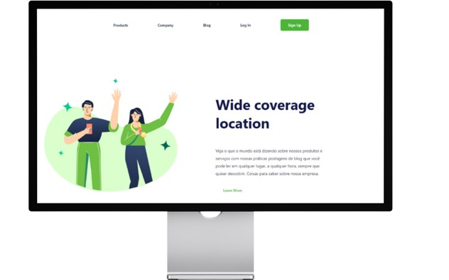
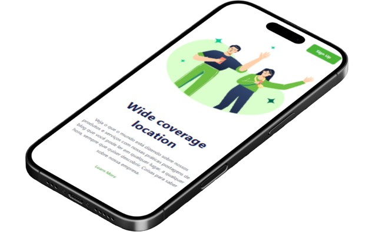

<h1>🐾 Positive - Landing Page</h1>
 

Bem-vindo ao **Positive**! 🚀  
Uma landing page moderna e responsiva feita com HTML e CSS puro, perfeita para quem quer aprender, se inspirar ou criar projetos incríveis.

 
<h3>🛠️ Tecnologias Utilizadas</h3>

 
<h3>✨ Funcionalidades</h3>
<ul>
  <li>📱 **Design Responsivo:** Adapta-se a qualquer dispositivo.</li>
  <li>🎨 **Layout Moderno:** Visual agradável e navegação intuitiva.</li>
  <li>🖱️ **Botões Interativos:** Efeitos de hover e alertas.</li>
  <li>📰 **Conteúdo Informativo:** Seções sobre produtos, empresa e blog.</li>
  <li>🖼️ **Imagem Ilustrativa:** Destaque visual para sua marca.</li>
</ul>
 
<h3>👀 Preview</h3>

  
  

